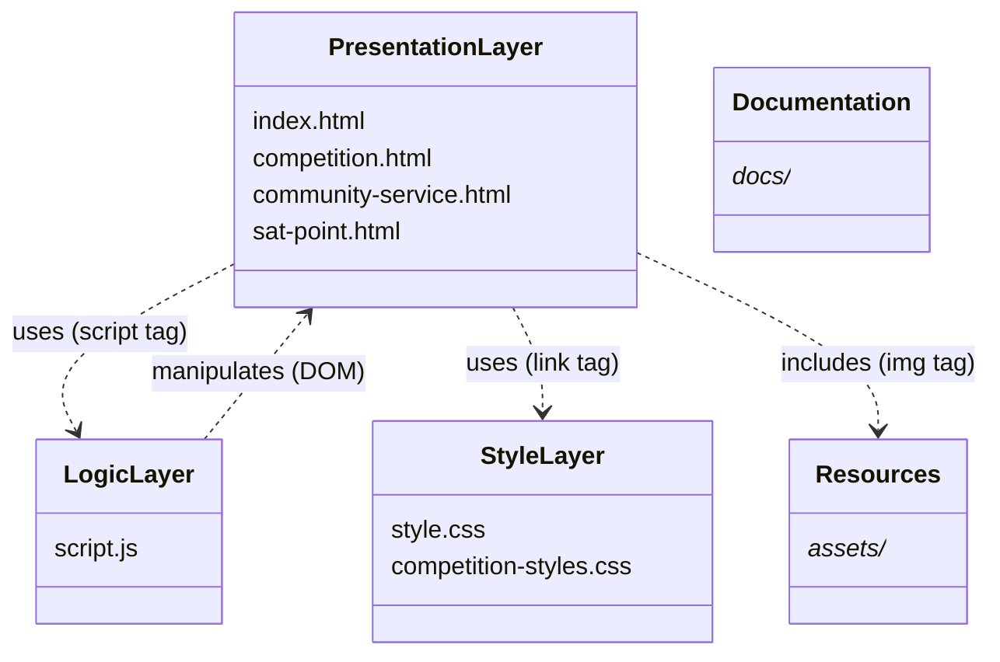
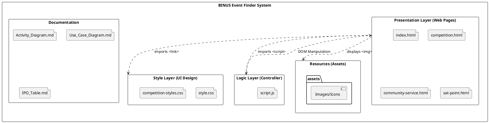

# Package Diagram

This document illustrates the structure of the **BINUS Event Finder** application using a UML Package Diagram.

## 1. ASCII Representation

## 2. PlantUML Diagram

## 3. Package Descriptions

| Package | Component | Description |
| :--- | :--- | :--- |
| **Presentation Layer** | HTML Files | Contains the structural markup for the web pages (`index`, `competition`, `community-service`, `sat-point`). Acts as the **View** in the MVC-like structure. |
| **Logic Layer** | `script.js` | Contains the client-side logic for event handling, data filtering, and DOM updates. Acts as the **Controller**. |
| **Style Layer** | CSS Files | Contains the visual styling rules (`style.css`). `competition-styles.css` appears to be a supplementary or draft style sheet. |
| **Resources** | `assets/` | Stores static assets such as identifying logos, favicons, and other graphics. |
| **Documentation** | `docs/` | Contains project documentation including diagrams and specifications. |
