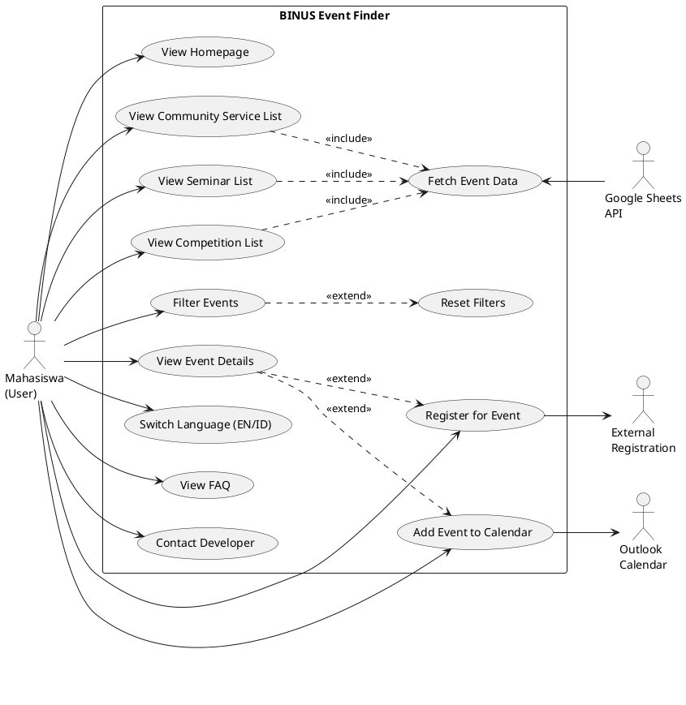

# Use Case Diagram
## BINUS Event Finder

---

## Actor Identification

| Actor | Deskripsi |
|-------|-----------|
| **Mahasiswa (User)** | Pengguna utama yang mengakses website untuk mencari dan melihat informasi acara BINUS |
| **Google Sheets API** | External system yang menyediakan data acara (seminar, kompetisi, community service) |
| **Outlook Calendar** | External system untuk menyimpan event ke kalender pengguna |

---

## Use Case Diagram (ASCII Art)

```
                                    ┌─────────────────────────────────────────────────────────────────────┐
                                    │                                                                     │
                                    │                      BINUS EVENT FINDER                             │
                                    │                                                                     │
                                    │  ┌─────────────────────┐          ┌─────────────────────┐          │
                                    │  │                     │          │                     │          │
      ┌───┐                         │  │   View Homepage     │          │   Switch Language   │          │
      │ ○ │                         │  │                     │          │      (EN/ID)        │          │
     /│ │\────────────────────────────►└─────────────────────┘          └─────────────────────┘          │
      │ │                           │            │                                 ▲                     │
     / \                            │            │                                 │                     │
   Mahasiswa                        │            ▼                                 │                     │
    (User)                          │  ┌─────────────────────┐                     │                     │
      │                             │  │                     │                     │                     │
      │                             │  │   View Seminar      │─────────────────────┤                     │
      ├────────────────────────────────►      List           │                     │                     │
      │                             │  │                     │                     │                     │
      │                             │  └─────────────────────┘                     │                     │
      │                             │            │                                 │                     │
      │                             │            │ <<include>>                     │                     │
      │                             │            ▼                                 │                     │
      │                             │  ┌─────────────────────┐                     │                     │
      │                             │  │                     │                     │                     │
      │                             │  │   View Competition  │─────────────────────┤                     │
      ├────────────────────────────────►      List           │                     │                     │
      │                             │  │                     │                     │                     │
      │                             │  └─────────────────────┘                     │                     │
      │                             │            │                                 │                     │
      │                             │            │ <<include>>                     │                     │
      │                             │            ▼                                 │                     │
      │                             │  ┌─────────────────────┐                     │                     │
      │                             │  │                     │                     │                     │
      │                             │  │   View Community    │─────────────────────┘                     │
      ├────────────────────────────────►   Service List      │                                           │
      │                             │  │                     │                                           │
      │                             │  └─────────────────────┘                                           │
      │                             │            │                                                       │
      │                             │            │                                                       │
      │                             │            │ <<include>>                                           │
      │                             │            ▼                                                       │
      │                             │  ┌─────────────────────┐        ┌─────────────────────┐           │
      │                             │  │                     │        │                     │           │
      ├────────────────────────────────►   Filter Events     │───────►│   Reset Filters     │           │
      │                             │  │                     │<<extend│                     │           │
      │                             │  └─────────────────────┘        └─────────────────────┘           │
      │                             │            │                                                       │
      │                             │            │ <<include>>                                           │
      │                             │            ▼                                                       │
      │                             │  ┌─────────────────────┐                                           │
      │                             │  │                     │                                           │
      │                             │  │   View Event        │                                           │
      ├────────────────────────────────►   Details           │                                           │
      │                             │  │                     │                                           │
      │                             │  └─────────────────────┘                                           │
      │                             │            │                                                       │
      │                             │            │ <<extend>>                                            │
      │                             │            ▼                                                       │
      │                             │  ┌─────────────────────┐                              ┌───┐        │
      │                             │  │                     │                              │ ○ │        │
      ├────────────────────────────────►   Register for      │                             /│ │\        │
      │                             │  │   Event             │──────────────────────────────│ │         │
      │                             │  │                     │                             / \          │
      │                             │  └─────────────────────┘                           External       │
      │                             │                                                   Registration    │
      │                             │                                                     Page          │
      │                             │  ┌─────────────────────┐                              ┌───┐        │
      │                             │  │                     │                              │ ○ │        │
      ├────────────────────────────────►   Add Event to      │                             /│ │\        │
      │                             │  │   Calendar          │──────────────────────────────│ │         │
      │                             │  │                     │                             / \          │
      │                             │  └─────────────────────┘                           Outlook        │
      │                             │                                                    Calendar       │
      │                             │                                                                    │
      │                             │  ┌─────────────────────┐                                           │
      │                             │  │                     │                                           │
      ├────────────────────────────────►   View FAQ          │                                           │
      │                             │  │                     │                                           │
      │                             │  └─────────────────────┘                                           │
      │                             │                                                                    │
      │                             │  ┌─────────────────────┐                                           │
      │                             │  │                     │                                           │
      └────────────────────────────────►   Contact           │                                           │
                                    │  │   Developer         │                                           │
                                    │  │                     │                                           │
                                    │  └─────────────────────┘                                           │
                                    │                                                                    │
                                    │                                                       ┌───┐        │
                                    │                                                       │ ○ │        │
                                    │  ┌─────────────────────┐                             /│ │\        │
                                    │  │                     │◄─────────────────────────────│ │         │
                                    │  │   Fetch Event       │                             / \          │
                                    │  │   Data              │                          Google          │
                                    │  │                     │                          Sheets          │
                                    │  └─────────────────────┘                            API           │
                                    │                                                                    │
                                    └────────────────────────────────────────────────────────────────────┘
```

---

## Use Case List

### Primary Actor: Mahasiswa (User)

| No | Use Case | Deskripsi |
|----|----------|-----------|
| UC-01 | View Homepage | Melihat halaman utama dengan kategori acara dan FAQ |
| UC-02 | View Seminar List | Melihat daftar seminar dan kegiatan SAT points |
| UC-03 | View Competition List | Melihat daftar lomba dan kompetisi |
| UC-04 | View Community Service List | Melihat daftar kegiatan pengabdian masyarakat |
| UC-05 | Filter Events | Memfilter acara berdasarkan search, topic, location, timeline, dan sort |
| UC-06 | Reset Filters | Mengembalikan semua filter ke kondisi default |
| UC-07 | View Event Details | Melihat detail lengkap dari sebuah acara |
| UC-08 | Register for Event | Mendaftar ke acara melalui link eksternal |
| UC-09 | Add Event to Calendar | Menambahkan acara ke Outlook Calendar |
| UC-10 | Switch Language | Mengganti bahasa tampilan (EN/ID) |
| UC-11 | View FAQ | Melihat daftar pertanyaan yang sering diajukan |
| UC-12 | Contact Developer | Menghubungi developer via WhatsApp/Email/LinkedIn |

### Secondary Actor: Google Sheets API

| No | Use Case | Deskripsi |
|----|----------|-----------|
| UC-13 | Fetch Event Data | Mengambil data acara dari Google Sheets |

### Secondary Actor: Outlook Calendar

| No | Use Case | Deskripsi |
|----|----------|-----------|
| UC-14 | Save Calendar Event | Menyimpan acara ke kalender Outlook user |

---

## Use Case Relationships

### <<include>> Relationships
| Base Use Case | Included Use Case | Penjelasan |
|---------------|-------------------|------------|
| View Seminar List | Fetch Event Data | Untuk menampilkan daftar seminar, sistem harus mengambil data dari Google Sheets |
| View Competition List | Fetch Event Data | Untuk menampilkan daftar kompetisi, sistem harus mengambil data dari Google Sheets |
| View Community Service List | Fetch Event Data | Untuk menampilkan daftar comserv, sistem harus mengambil data dari Google Sheets |
| Filter Events | Fetch Event Data | Filter hanya bisa bekerja setelah data tersedia |

### <<extend>> Relationships
| Base Use Case | Extended Use Case | Kondisi Extension |
|---------------|-------------------|-------------------|
| Filter Events | Reset Filters | User memilih untuk reset filter |
| View Event Details | Register for Event | User memilih untuk mendaftar |
| View Event Details | Add Event to Calendar | User memilih untuk menambahkan ke kalender |

---

## PlantUML Code



---

## Use Case Specifications (Detail)

### UC-01: View Homepage

| Aspek | Deskripsi |
|-------|-----------|
| **Use Case Name** | View Homepage |
| **Actor** | Mahasiswa (User) |
| **Description** | User mengakses halaman utama BINUS Event Finder |
| **Precondition** | User memiliki akses internet dan browser |
| **Main Flow** | 1. User membuka URL BINUS Event Finder <br> 2. Sistem menampilkan homepage dengan hero section <br> 3. Sistem menampilkan 3 kategori acara (Seminar, Competition, ComServ) <br> 4. Sistem menampilkan FAQ section |
| **Postcondition** | Homepage ditampilkan dengan semua komponen |

### UC-05: Filter Events

| Aspek | Deskripsi |
|-------|-----------|
| **Use Case Name** | Filter Events |
| **Actor** | Mahasiswa (User) |
| **Description** | User memfilter daftar acara berdasarkan kriteria tertentu |
| **Precondition** | User berada di halaman daftar acara (Seminar/Competition/ComServ) |
| **Main Flow** | 1. User memasukkan kata kunci di search box <br> 2. User memilih topic dari dropdown <br> 3. User memilih lokasi dari checkbox <br> 4. User mengatur timeline slider <br> 5. User memilih urutan sort <br> 6. Sistem menampilkan hasil filter |
| **Alternative Flow** | User dapat menggunakan satu atau lebih filter |
| **Postcondition** | Daftar acara yang sesuai kriteria ditampilkan |

### UC-09: Add Event to Calendar

| Aspek | Deskripsi |
|-------|-----------|
| **Use Case Name** | Add Event to Calendar |
| **Actor** | Mahasiswa (User), Outlook Calendar |
| **Description** | User menambahkan acara ke Outlook Calendar |
| **Precondition** | User melihat detail acara dengan tombol "Add to Outlook" |
| **Main Flow** | 1. User klik tombol "Add to Outlook" <br> 2. Sistem mengekstrak detail acara (title, date, location) <br> 3. Sistem membuat deep link Outlook <br> 4. Sistem membuka tab baru ke Outlook Calendar <br> 5. User mereview dan menyimpan event |
| **Postcondition** | Event tersimpan di Outlook Calendar user |

---

*Dokumen ini dibuat untuk keperluan dokumentasi Program Design Method - BINUS Event Finder*
